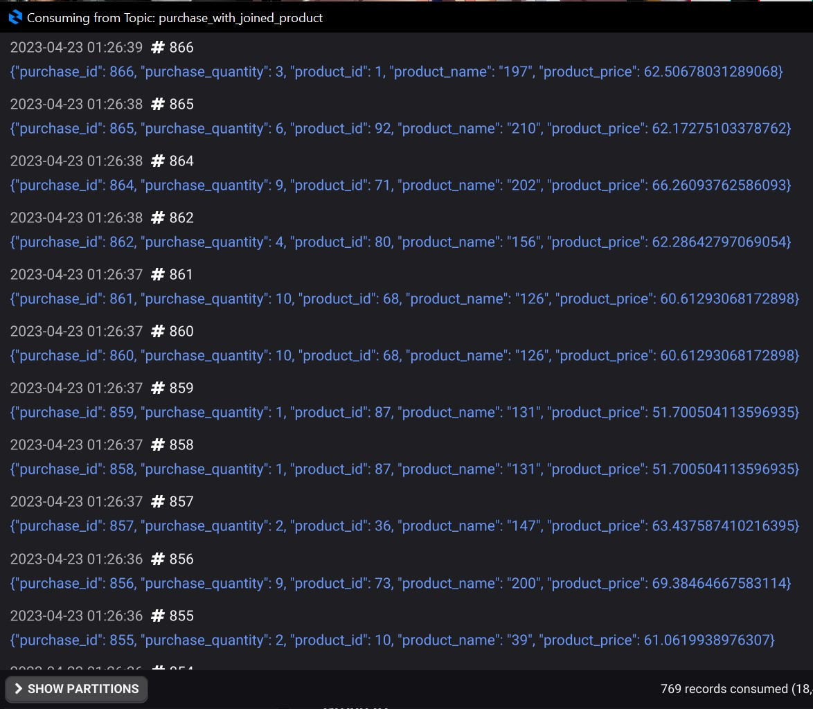
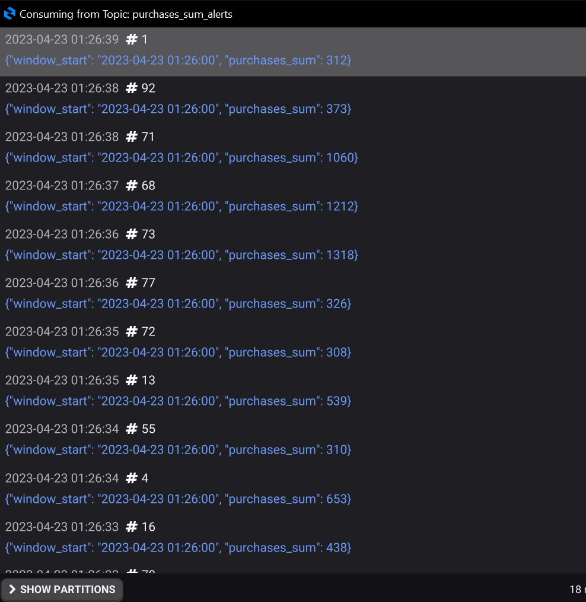

# KafkaStreams

С помощью *src/main/java/ru/netology/dsw/processor/ProductJoinerApp.java* создан топик, в котором к покупкам были присоединены данные по продукту:

Далее написан скрипт - *src/main/java/ru/netology/dsw/dsl/PurchacesSumAlertsApp.java*, который создает топик и в него записывает сообщения, если сумма енег заработанных по этому продукту (для каждой покупки сумма - это purchase.quantity * product.price) за последнюю минуту больше **300**:

Да, в задании указан алерт при сумме более 3000, а не 300, но с заданными в авро схемах ценнами, это очень маловероятный сценарий, нужно генерировать очень много данных, чтобы получить хорошую иллюстрацию в топике.
